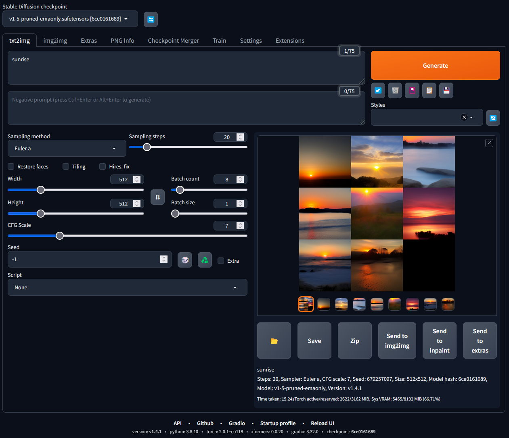

# Stable Diffusion Docker
Simple ready-to-run docker containers for Stable Diffusion Web and Comfy UI.



## Getting Started

### Prerequisites
Make sure you have Docker installed and configured on your system.
Also, you need an Nvidia graphics card. This container only works with an Nvidia Card.

1. Make sure Docker is installed. 
2. Install the CUDA drivers, you can find instructions on how to do that here: [https://developer.nvidia.com/cuda-downloads](https://developer.nvidia.com/cuda-downloads)
3. Install the Nvidia Container Toolkit: [https://docs.nvidia.com/datacenter/cloud-native/container-toolkit/](https://docs.nvidia.com/datacenter/cloud-native/container-toolkit/latest/install-guide.html#docker)

### Starting the Container(s)

#### Docker Compose
I highly recommend using Docker Compose.

You can start one of the following services like so:
````bash
# Comfy UI
docker compose up comfy-ui

# Stable Diffusion Web
docker compose up stable-diffusion-web
````
If you do not provide a service name, both will start.

#### Manually starting Comfy UI
This will start Comfy UI on port **8188** and save all data tp **./data**.
It will also enable live previews.
````bash
docker run \
  -v ./data:/data:rw \
  -e "LAUNCH_ARGS=--preview-method auto" \
  -p 8188:8188/tcp \
  --gpus all \
  ghcr.io/parzival-space/stable-diffusion:comfy-ui
````

#### Manually starting Stable Diffusion Web
This will start Stable Diffusion Web on port **7680** and save all data tp **./data**.
It will also enable extension support.
```bash
docker run \
  -v ./data:/data:rw \
  -p 7680:7680/tcp \
  --gpus all \
  -e "LAUNCH_ARGS=--xformers --update-check --enable-insecure-extension-access" \
  ghcr.io/parzival-space/stable-diffusion:stable-diffusion-web
```

## License
[stable-diffusion-webui](https://github.com/AUTOMATIC1111/stable-diffusion-webui) by [AUTOMATIC1111](https://github.com/AUTOMATIC1111) is licensed under the GNU Affero General Public License v3.0.<br>
[Comfy UI](https://github.com/comfyanonymous/ComfyUI) by [comfyanonymous](https://github.com/comfyanonymous) is licensed under the GNU General Public License v3.0.<br>
This project is licensed under the GNU General Public License v3.0.<br>
For more information, please refer to the ``LICENSE`` file.
