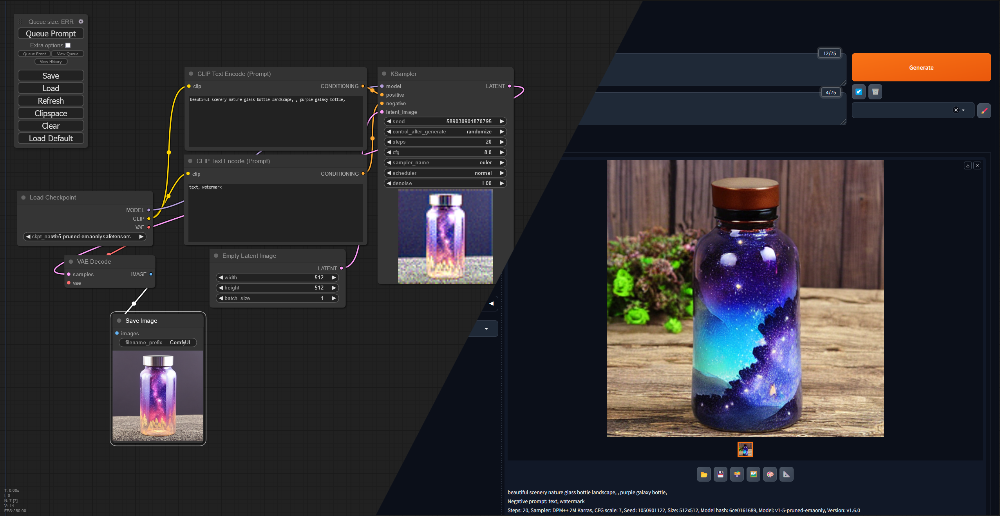

# Stable Diffusion Docker
A simple read-to-run docker container for Stable Diffusion Web Ui.



## Getting Started
To use this container, follow these simple steps:

### Prerequisites
Make sure you have Docker installed and configured on your system.
Also you need a Nvidia graphics card. This container only works with an Nvidia Card.

It is possible to run this in WSL 2. Docker is still required. 
You can find instructions on how to install the CUDA drivers here:
[https://developer.nvidia.com/cuda-downloads](https://developer.nvidia.com/cuda-downloads?target_os=Linux&target_arch=x86_64&Distribution=WSL-Ubuntu&target_version=2.0&target_type=deb_network)

### Starting the Container
To start the container, execute the following command:
```bash
docker run \
  -v ./data:/data:rw \
  -p 7680:7680/tcp \
  --gpus all \
  ghcr.io/parzival-space/stable-diffusion:latest
```
Alternatively, you can use the provided ``docker-compose.yml`` file if you prefer.

## License
Because of the licensing of [stable-diffusion-webui](https://github.com/AUTOMATIC1111/stable-diffusion-webui), this project is also licensed under the GNU Affero General Public License v3.0.
For more information, please refer to the ``LICENSE`` file.
